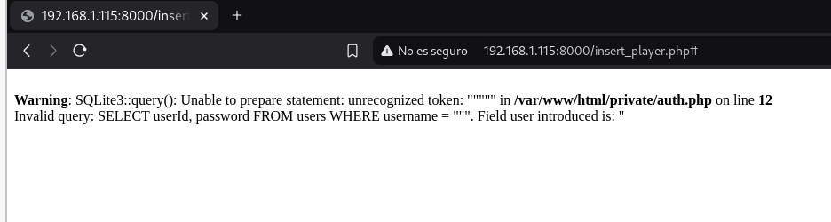
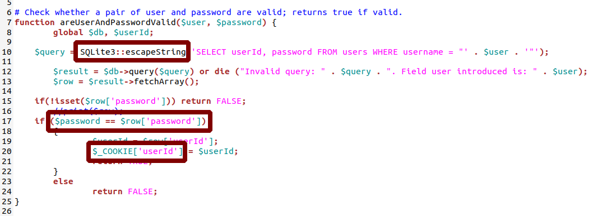
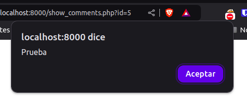
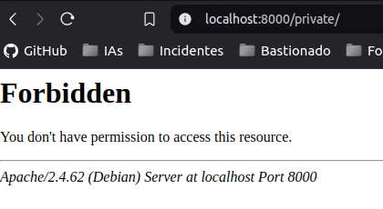
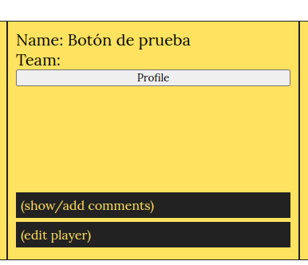

# Parte 1 SQLi


## a) Ejemplo de error en consulta SQL



| Pregunta                                                       | Resultado                                               |
| -------------------------------------------------------------- | ------------------------------------------------------- |
| Escribo los valores                                            | "                                                       |
| En el Campo                                                    | User                                                    |
| Del formulario de la página                                    | http://web_vulnerable/insert_player.php#            |
| La consulta que se ejecuta es                                  | SELECT userId, password FROM users WHERE username = """ |
| Campos del formulario web utilizados en la consulta SQL        | password                                                |
| Campos del formulario web **no** utilizados en la consulta SQL | userId                                                  |


## b) Ataque por diccionario sin saber el usuario


| Pregunta                                              | Respuesta                                                                                                          |
| ----------------------------------------------------- | ------------------------------------------------------------------------------------------------------------------ |
| Explicación del ataque                                | El ataque consiste en repetir una consulta utilizando en cada interacción una contraseña diferente del diccionario |
| Campo de usuario con que el ataque ha tenido éxito    | " OR 1=1 AND password="1234"-- -                                                                                   |
| Campo de contraseña con que el ataque ha tenido éxito | 1234                                                                                                               |


## c) Error de programación



| Pregunta                                 | Respuesta                                                                                                                                       |
| ---------------------------------------- | ----------------------------------------------------------------------------------------------------------------------------------------------- |
| Explicación del error                    | Se usa SQLite3::escapeString para evitar SQLi, pero no está funcionando                                                                         |
| Solución: Cambiar la línea con el código | $query = SQLite3::escapeString('SELECT userId, password FROM users WHERE username = "' . $user . '"');                                          |
| por la siguiente línea                   | $query = $db->prepare('SELECT userId, password FROM users WHERE username = :username');<br>$query->bindValue(':username', $user, SQLITE3_TEXT); |
| | |
| Explicación del error                    | Uso de `$_COOKIE` para almacenar información sensible                                                                                           |
| Solución: Cambiar la línea con el código | $_COOKIE['userId'] = $userId;                                                                                                                   |
| por la siguiente línea                   | session_start();  // Esta línea debe estar al comienzo del archivo.<br>$_SESSION['userId'] = $userId;<br>                                       |
| | |
| Explicación del error                    | No se está validando si el `username` existe                                                                                                    |
| Solución: Cambiar la línea con el código | if(!isset($row['password'])) return FALSE;<br>                                                                                                  |
| por la siguiente línea                   | if ($row === false) {<br>    return FALSE; // Usuario no existe<br>}<br>                                                                        |
| | |
| Explicación del error                    | Comparación de contraseñas en texto plano                                                                                                       |
| Solución: Cambiar la línea con el código | if ($password == $row['password'])<br>                                                                                                          |
| por la siguiente línea                   | if (password_verify($password, $row['password']))<br>                                                                                           |


## d) Vulnerabilidad en add_comment.php

| Pregunta | Respuesta |
| - | - |
| Vulnerabilidad detectada | Inyección SQL en el parámetro id de la consulta SQL. |
| Descripción del ataque | El atacante puede manipular el valor de $_GET['id'] en la URL para ejecutar consultas maliciosas en la base de datos, como robar información o modificar datos. Por ejemplo, usando: ?id=1; DROP TABLE comments;--. |
| ¿Cómo podemos hacer que sea segura esta entrada? | Utilizar consultas parametrizadas para evitar la inyección SQL, como prepare y bindValue. También validar y sanitizar el parámetro id asegurándose de que solo acepte valores numéricos. |
| | |
| Vulnerabilidad detectada | Falta de sanitización al imprimir datos provenientes de la base de datos. |
| Descripción del ataque | Si un atacante logra inyectar código HTML o JavaScript malicioso en los campos username o body de la base de datos, dicho contenido se renderizará en el navegador del usuario, permitiendo un ataque XSS. |
| ¿Cómo podemos hacer que sea segura esta entrada? | Escapar los datos antes de mostrarlos en la página utilizando funciones como htmlspecialchars para evitar la ejecución de código malicioso. |


# Parte 2 XSS


## a) alert

| Pregunta                      | Respuesta                                      |
| ----------------------------- | ---------------------------------------------- |
| Introduzco el mensaje         | ```<script>alert("Prueba")</script>```         |
| En el formulario de la página | http://web_vulnerable/add_comment.php?id=5 |




## b) & en URL

| Pregunta    | Respuesta                                                                    |
| ----------- | ---------------------------------------------------------------------------- |
| Explicación | "&amp" es una alternativa para que los navegadores entiendan el símbolo "&". |


## c) Problema al mostrar los comentarios

¿Cuál es el problema?  SQL Injection.
Sustituyo el código de la/las líneas:
```php
$query = "SELECT commentId, username, body FROM comments C, users U WHERE C.playerId =".$_GET['id']." AND U.userId = C.userId order by C.playerId desc"; 
$result = $db->query($query) or die("Invalid query: " . $query);
``` 

Por el siguiente código:
```php
$playerId = intval($_GET['id']); // Validar que sea un entero
$stmt = $db->prepare("SELECT commentId, username, body 
                      FROM comments C, users U 
                      WHERE C.playerId = :id AND U.userId = C.userId 
                      ORDER BY C.playerId DESC");
$stmt->bindValue(':id', $playerId, SQLITE3_INTEGER);
$result = $stmt->execute();
```

¿Cuál es el problema? XSS.
Sustituyo el código de la/las líneas
```php
echo "<div>
        <h4> ". $row['username'] ."</h4> 
        <p>commented: " . $row['body'] . "</p>
      </div>";
```

Por el siguiente código
```php
echo "<div>
        <h4>" . htmlspecialchars($row['username'], ENT_QUOTES, 'UTF-8') . "</h4> 
        <p>commented: " . htmlspecialchars($row['body'], ENT_QUOTES, 'UTF-8') . "</p>
      </div>";
```


## d) Otras páginas afectadas 

| Pregunta                 | Respuesta                                      |
| ------------------------ | ---------------------------------------------- |
| Otras páginas afectadas  | http://web_vulnerable/insert_player.php    |
| ¿Cómo lo he descubierto? | Probando en todos los formularios que he visto |


# Parte 3 Control de acceso, autenticación y sesiones de usuarios
**

## a) Registro más seguro
- Validar las entradas de los usuarios.
	La aplicación no valida si el usuario está inyectando código SQL.
- Encriptar las contraseñas en lugar de guardarlas en texto plano.
	Por lo que se puede ver en el código, las contraseñas se guardan sin cifrar.
- Se crean usuario con privilegios.
	Cualquier persona puede crear usuarios que pueden añadir entradas en la página.
- Prohibir contraseñas inseguras.
	Evitar el uso de contraseñas débiles.

## b) Login más seguro
- Validar las entradas de los usuarios.
	La aplicación no valida si el usuario está inyectando código SQL.
- Verificación de contraseñas de manera segura.
	Usar la función **password_verify()** para comprobar si la contraseña coincide con la de la base de datos.
- Limitar los intentos de login(Evitar fuerza bruta).
	Bloquear a los usuarios que fallen 3-5 veces el login para evitar los ataques de fuerza bruta.

## c) Registro aún más seguro
- Solo poder entrar en esta página si estás logeado.
	De esta forma evitamos que cualquier persona cree nuevos usuarios.
- Hacer que un administrador valide a los usuarios.
	Si, de alguna forma, alguien desconocido se registra, sería necesario que un administrador valide ese usuario.
- Crear roles de usuario.
	Hacer distinciones entre usuarios administradores y usuarios comunes.

## d) Acceso a la carpeta private


Por lo que se ve en la imagen anterior, no, no tenemos acceso a la carpeta private desde el navegador, pero si tuviéramos acceso, tendríamos que denegar el acceso a la carpeta editando los archivos de configuración del apache.

## e) Suplantar la identidad
Como hicimos en el apartado 1.b, suplantamos la identidad del usuario *luis*. Esto se podría evitar haciendo uso de los tokens CSRF en los formularios de login.

# Parte 4 Servidores web
- Validación de entradas.
- Contraseñas seguras.
- Limitación de intentos de login.
- Roles de usuario.
- Acceso restringido a archivos sensibles.
- Uso de CSRF tokens.

# Parte 5 CSRF

## a) Añadir botón para donar



| Pregunta    | Respuesta                                                                                                                                  |
| ----------- | ------------------------------------------------------------------------------------------------------------------------------------------ |
| En el campo | team                                                                                                                                       |
| Introduzco  | ```<form action="http://web.pagos/donate.php?amount=100&receiver=attacker" method="get"> <button type="submit">Profile</button> </form>``` |

## b) Redirigir al ver los comentarios

| Pregunta    | Respuesta                                                                                                                                                |
| ----------- | --------------------------------------------------------------------------------------- |
| En el campo | comentario                                                                              |
| Introduzco  | ```<script>window.location='http://www.donate.co/?amount=100&destination=ACMEScouting/';</script>``` |

## c) Condiciones para transferir el dinero

Para que las donaciones ocurran, los usuarios que le den al botón o entren a la sección de comentarios, deben estar logeados en la página.

## d) Otro tipo de ataque

```html
<form action="donate.php" method="POST">
    <input type="hidden" name="amount" value="100">
    <input type="hidden" name="receiver" value="<script>window.location='http://www.donate.co/?amount=100&destination=ACMEScouting/';</script>">
    <input type="submit" value="Realizar donación">
</form>
```
